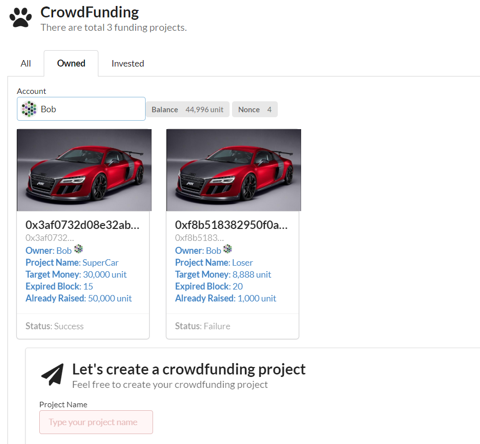
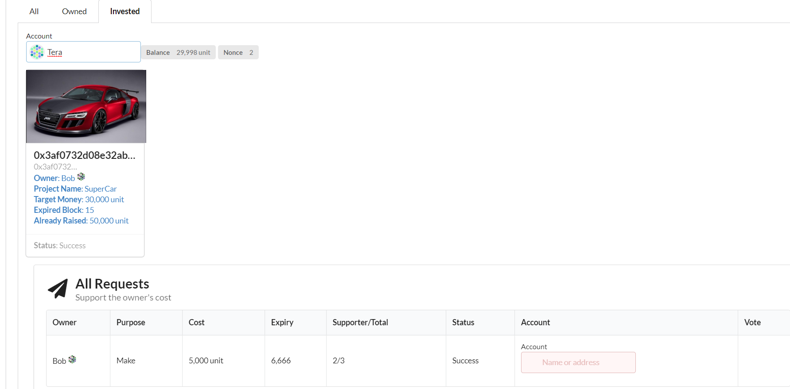

# substrate-crowdfunding

This is crowdfunding project based on substrate.






# Building

Install Node(10.16.0) and Yarn:

```shell
$ curl -sL https://raw.githubusercontent.com/creationix/nvm/v0.33.11/install.sh -o install_nvm.sh
$ sudo chmod +x install_nvm.sh
$ ./install_nvm.sh
$ source ~/.profile
$ nvm install 10.16.0
# check `node -v` and `npm -v` then
$ npm install yarn -g
```

Install Rust:

```bash
$ curl https://getsubstrate.io -sSf | bash -s -- --fast
```

Clone the project:

```shell
$ git clone https://github.com/SherLzp/substrate-crowdfunding.git
```

Compile the project:

Substrate Part:

```shell
$ cd substrate-crowdfunding/substrate-crowdfunding
$ ./scripts/build.sh
$ cargo build --release
```

UI Part:

```shell
$ cd substrate-crowdfunding/substrate-crowdfunding-ui
$ yarn install
```

# Run

Substrate:

```shell
$ cd substrate-crowdfunding/substrate-crowdfunding
$ ./target/release/substrate-crowdfunding --dev
```

UI:

```shell
$ cd substrate-crowdfunding/substrate-crowdfunding-ui
$ yarn run dev
```

Access via:

http://localhost:8000

# Tutorial

If you are interested in the project, you can read the tutorial here:

[Substrate-Crowdfunding Tutorial Part1](https://www.sher.vip/article/29)

[Substrate-Crowdfunding Tutorial Part2](https://www.sher.vip/article/30)

